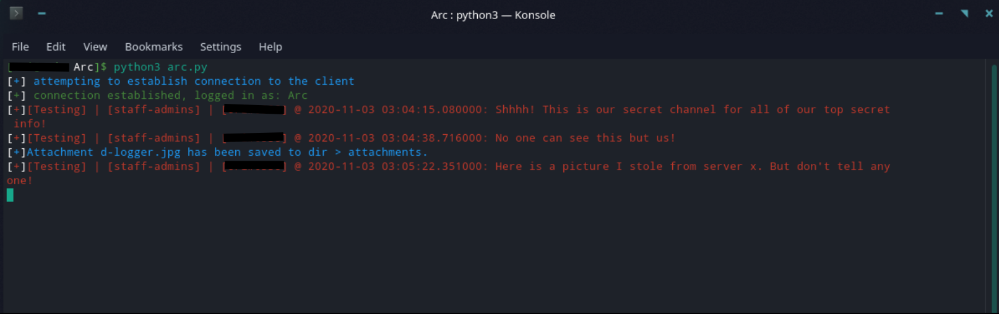

# d-logger
Discord bot code written in python3 for spying on everyone and everything that goes down in discord servers that your bot is in.

You can auto download pictures/gifs that get sent in all servers aswell as **All** text messages that get sent in the servers the bot is in. It saves the text/conversations into a .txt file (you can change this if you want but for what I have it's a .txt file). And all pictures/attachments get sent to a folder/directory that you specify. Preferably a folder/directory in the main repo folder/directory. (or if you are skilled enough, send to a remote server ;) )

This simple bit of code can be very easily added into your python discord bot code and can be edited to fit your needs if you wish. (credit me for making it or inspiration of course)

# Here is an example picture of my terminal while being ran/tested on a bot called Arc

I am not responsible or liable for the misuse or malicious purpose/applications of this code. Use at your own risk.
If you get punished for using this, that is **All** and fully on you. I made this code to be a proof of concept to show how easily you can spy on people/servers using discord bots/code.
And I shall not be punished for the actions of those who do decide to use this code.
